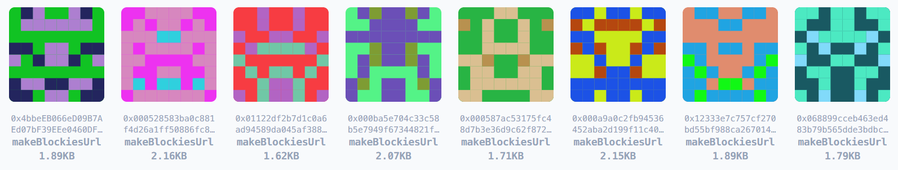

# blockies-react-svg

Blockies react svg function component, blocky identicons, address-unique Ethereum avatar, svg base64 url.

You can have responsive width and height without rerendering because of SVG properties. meanwhile, it will store the result.

You also can use base64 url, it is smaller(~2kb) than the canvas size(~16kb).(8x8)

> the address will auto toLowerCase until set `caseSensitive` property.



[**Demo of React SPA**](https://yysuni.github.io/blockies-react-svg/) (you can read the code in the `gh-pages` branch)

## Todo
- [x] ts component
- [x] base64 url
- [x] js compile
- [x] demo display (github pages)
- [x] pure base64 (remove react-dom/server dependence, -70kb bundle size)
- [ ] support nodejs
- [ ] svg mirror optmization (reduce image size)
- [ ] svg polygon optmization (reduce image size)
- [ ] more shapes
- [ ] different rand algorithm

## Installation

```bash
$ npm i blockies-react-svg
```

### 1. Use React FC:

```tsx
import BlockiesSvg from 'blockies-react-svg'
// or use tsx directly:
// import BlockiesSvg from 'blockies-react-svg/src/BlockiesSvg.tsx'
// (file path may be change, please check it when error happen.)

<BlockiesSvg 
  address={address}
  className='classname'
  style={styles} 
  />
```

### 2. Use React Sync Component:

```tsx
import BlockiesSvgSync from 'blockies-react-svg/dist/es/BlockiesSvgSync.js'
// or use tsx directly:
// import BlockiesSvgSync from 'blockies-react-svg/src/BlockiesSvgSync.tsx'
// (file path may be change, please check it when error happen.)

<BlockiesSvgSync 
  address={address} 
  className='classname'
  style={styles} 
  />
```

### 3. Use Base64 URL:

```tsx
import makeBlockiesUrl from 'blockies-react-svg/dist/es/makeBlockiesUrl.js'
// or use ts directly:
// import makeBlockiesUrl from 'blockies-react-svg/src/makeBlockiesUrl.ts'
// (file path may be change, please check it when error happen.)


```

## Why SVG?

Canvas render doesn't support arbitrary size or other customized styles.

SVG is the better experience, because of the infinite resolution.

SVG base64 file size is smaller than canvas.
